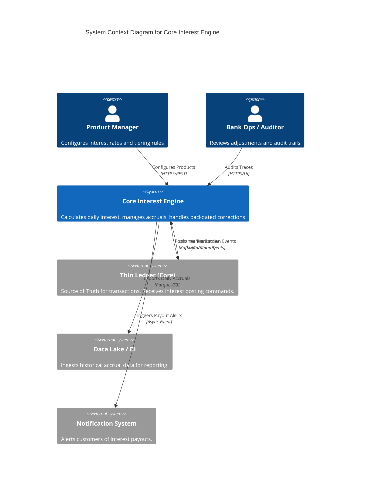

# C4 Context Diagram

## 1. System Overview
The **Core Interest Engine (CIE)** is a critical subsystem within the Banking Platform. It acts as a sidecar to the main Transaction Ledger, responsible specifically for the complex domain of interest accrual, capitalization, and tax withholding calculation.

## 2. Context Diagram (Mermaid)

## 3. Key Interactions
* **Inbound**: The CIE consumes a high-volume stream of TransactionSettled events from the Ledger.
* **Outbound**: The CIE emits PostTransactionCommand messages back to the Ledger to book interest.
* **Configuration**: Product Managers define rates (e.g., "Gold Savings = 5.0%") via the Configuration API.