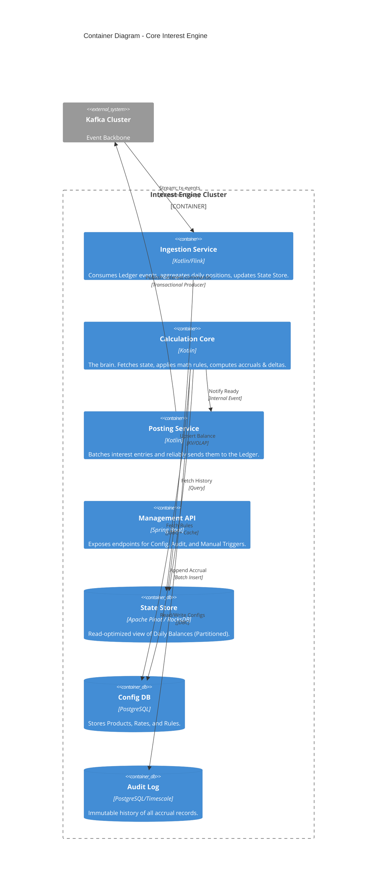

# C4 Container Diagram

## 1. Architectural Style
The system follows a **Stream-First (Kappa) Architecture** with local state optimization.
* **Communication:** Asynchronous via Kafka (for data) and REST (for config/management).
* **Concurrency:** Virtual Threads (Project Loom) for high-throughput I/O.

## 2. Container Diagram (Mermaid)

## 3. Component Responsibilities
* **Ingestion Service**: Responsible for "De-noising" the ledger stream. It converts thousands of raw transactions into a single "End-of-Day Balance" record per account per day.
* **Calculation Core**: Stateless logic. Input: `[History, Rules]`. Output: `[Accrual, Adjustment]`.
* **State Store**: A specialized store (Pinot or partitioned Postgres) designed to answer "What was the balance of Account X on Day Y?" in < 10ms.