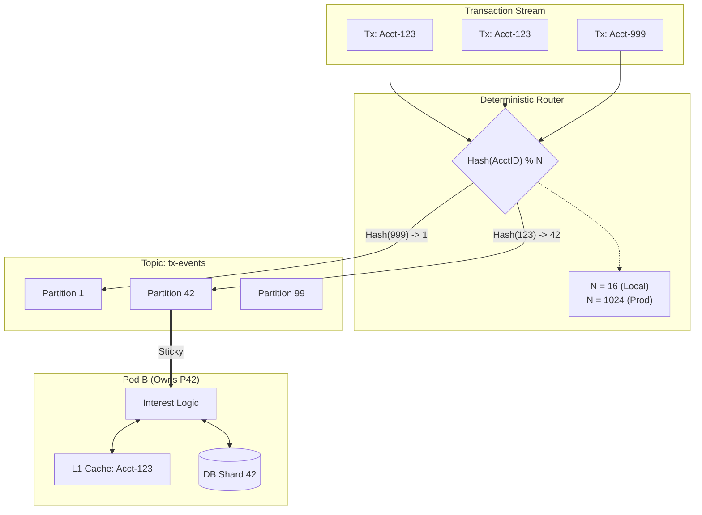

# Architecture: Sharding & Partitioning

## 1. The Challenge
Processing **100M accounts** within a 4-hour window requires parallel processing. Naive load balancing fails because interest calculation requires **state locality** (access to the specific account's history).

## 2. The Solution: Shared-Nothing Static Partitioning

We utilize a **Deterministic Partitioning Model** based on the Account ID.

### 2.1 The Magic Number: 1,024 (Variable)
We divide the entire account universe into **N Logical Partitions**.
* **Routing Function:** `PartitionID = Hash(AccountID) % PartitionCount`
* **Invariant:** All data for `Account A` (transactions, balance history, accrual logs) always resides in the same partition.

| Environment | Partition Count | Rationale |
| :--- | :--- | :--- |
| **Production** | **1,024** | Supports ~100M accounts (~100k/partition). Allows scaling to 1,024 consumers. |
| **Local / CI** | **16** | Reduces overhead (RAM/CPU/File Descriptors) on developer machines. |

> **Note:** The application reads this value from the `SHARD_COUNT` environment variable to ensure the Hashing logic matches the Database topology.

### 2.2 Topology Mapping

| Layer | Unit | Mapping |
| :--- | :--- | :--- |
| **Kafka** | Topic `tx-events` | **1,024 Partitions**. Key = `AccountID`. |
| **Compute** | Kubernetes Pods | **Dynamic**. KEDA scales pods. A single pod might consume partitions `{0..15}`. |
| **Database** | Postgres Tables | **1,024 Logical Tables** (Partitioned Table). Grouped onto N Physical Instances. |

## 3. Workflow: The "Sticky" Consumer
1.  **Ingest:** A transaction arrives for `Account-888`.
2.  **Hash:** `Hash(888) % 1024 = Partition 42`.
3.  **Route:** The message is sent to Kafka Partition 42.
4.  **Consume:** The Pod owning Partition 42 wakes up.
5.  **Context:** The Pod queries the DB, requesting data *only* for Partition 42.
6.  **Locality:** Because the DB is also physically clustered by Partition 42, the disk seek is sequential and fast.

## 4. Handling Data Skew ("The Jumbo Account")
**Risk:** One corporate account generates 1M transactions/day, lagging Partition 42.
**Mitigation:**
* **Pre-Aggregation:** The `Ingestion Service` uses a tumbling window (e.g., 5 minutes) to merge transactions in memory before writing to the State Store.
* **Result:** The Database only sees ~288 updates/day per account, regardless of transaction volume.