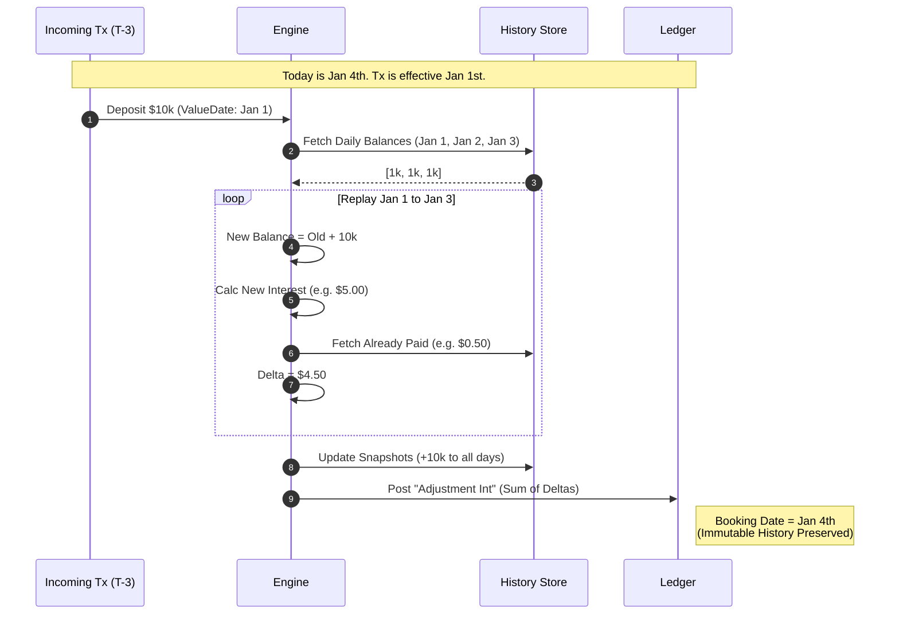

# Domain Logic: Backdated Transaction Handling

## 1. The Principle
**"History is Immutable, Correction is Additive."**
We never update an existing `interest_accrued` record. We append a specific `adjustment` record.

## 2. The Algorithm: Delta Replay
When a transaction arrives with `value_date < current_date`:

1.  **Identify Window:** Determine affected range $[t_{start}, t_{end}]$.
2.  **Fetch Snapshots:** Retrieve $B_{daily}$ (Balance) and $R_{daily}$ (Rate) for each day in the window.
3.  **Simulate:** Calculate $I_{ideal}$ using $(B_{daily} + Tx_{amount})$.
4.  **Compare:** Fetch sum of existing accruals $I_{actual}$ for that day.
5.  **Delta:** $\Delta = I_{ideal} - I_{actual}$.
6.  **Book:** Insert `AccrualRecord` with type `ADJUSTMENT`.

## 3. Scenario: The "Overdraft Flip"
**Situation:**
* Day 1 Balance: `$100` (Credit). Rate: `+2%`. Accrued: `+$0.005`.
* Backdated Tx: `-$200` effective Day 1.
* Revised Balance: `-$100` (Debit). Rate: `-10%` (Overdraft).

**Execution:**
1.  **Reversal:** We must claw back the paid interest. Delta 1 = `-$0.005`.
2.  **Charge:** We must charge the overdraft. Ideal Interest = `-$0.027`.
3.  **Net Adjustment:** `-$0.032`.

> **Note:** The system must support negative accruals (charges) even on savings products.